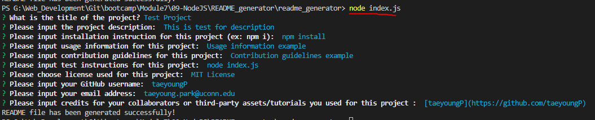
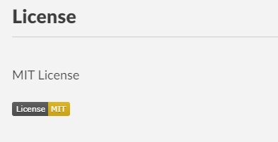

# Professional README Generator

## Task
When creating an open source project on GitHub, it’s important to have a high-quality README for the app. This should include what the app is for, how to use the app, how to install it, how to report issues, and how to make contributions&mdash;this last part increases the likelihood that other developers will contribute to the success of the project. 

User can quickly and easily create a README file by using a command-line application to generate one. This allows the project creator to devote more time to working on the project.


## User Story

```md
AS A developer
I WANT a README generator
SO THAT I can quickly create a professional README for a new project
```

## Acceptance Criteria

```md
GIVEN a command-line application that accepts user input
WHEN I am prompted for information about my application repository
THEN a high-quality, professional README.md is generated with the title of my project and sections entitled Description, Table of Contents, Installation, Usage, License, Contributing, Tests, and Questions
WHEN I enter my project title
THEN this is displayed as the title of the README
WHEN I enter a description, installation instructions, usage information, contribution guidelines, and test instructions
THEN this information is added to the sections of the README entitled Description, Installation, Usage, Contributing, and Tests
WHEN I choose a license for my application from a list of options
THEN a badge for that license is added near the top of the README and a notice is added to the section of the README entitled License that explains which license the application is covered under
WHEN I enter my GitHub username
THEN this is added to the section of the README entitled Questions, with a link to my GitHub profile
WHEN I enter my email address
THEN this is added to the section of the README entitled Questions, with instructions on how to reach me with additional questions
WHEN I click on the links in the Table of Contents
THEN I am taken to the corresponding section of the README
```

## Description 
The following video demonstrates the application functionality: 

* [Link to Video demonstration](https://drive.google.com/file/d/1NZqPElyt8qKsPsS-AdmoZbTsZBpRzh2X/view)




When the user run th application with command, bash terminal will come up wtih questions needed for generating README file. It will asks user to enter Project Title, Description for the project. User must enter title and descripton in order to create README, otherwise, application will keep askinng user to input them. Then app will ask user for installation instruction(ex: npm install), usage information, contribution guidelines, and test instructions(ex: node index.js). (These can be left empty if not applicable.)

App will also ask user for what license is used for the project. If user did not use any license, they can choose 'The Unlicense'. All other chosen license will be lncluded in README file with license badge and its link.



Then it asks user to input their GitHub username and email address to create Questions section. (User doese not need to add @ for their GitHub username).

Finally, app asks user to input credits for project collaborators or third-party assets or other tutorials they have used for the project. 

After answering all of the questions, readme file will be generated with name 'generated_README.md'.


(Example generated_READEME.md is lncluded in readme_generator directory.)


## How to Use
The application will be invoked by using the following command:

```bash
node index.js
```

After running the app with the command, it will prompt the user to provide inputs for generating README file. 

User must provide project title, project description, license used for the project (choose The Unlicense if no license was used), GitHub username, and email address. Other inputs are optional, but it is recommended user to input something for each section for quality README file. If not applicable, please leave blank('') for installation instruction and test instructions, and input 'N/A' for other sections.

README file is also generated with Table of contents and user will be able to jump to corresponding content by clicking the list from the Table of contents.

## Credits

 * npm [Inquirer package](https://www.npmjs.com/package/inquirer/v/8.2.4) 

 * Code for validating email address: https://stackoverflow.com/questions/46155/how-can-i-validate-an-email-address-in-javascript

 * License badges and links: https://gist.github.com/lukas-h/2a5d00690736b4c3a7ba, https://gist.github.com/kofiav/c1059e1075b67582e86b07aa9759e20d

---

© 2023 edX Boot Camps LLC. Confidential and Proprietary. All Rights Reserved.
